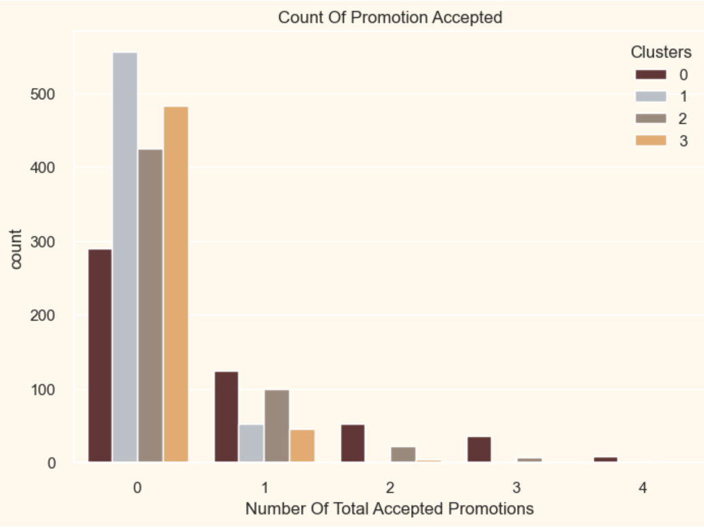

# Customer Segmentation using Clustering

This project demonstrates customer segmentation using clustering techniques. The goal is to group customers based on their attributes and behaviors, helping businesses understand their customer base and develop targeted marketing strategies.

## Table of Contents

- [Introduction](#introduction)
- [Dataset](#dataset)
- [Project Structure](#project-structure)
- [Requirements](#requirements)
- [Usage](#usage)
- [Visualization](#Visualization)
- [Results](#results)
- [Contributing](#contributing)
- [License](#license)

## Introduction

Customer segmentation involves dividing a customer base into distinct groups that share similar characteristics. In this project, clustering algorithms (such as K-Means) are applied to segment customers, allowing for better business decisions and marketing strategies.

## Dataset

- The dataset used contains customer attributes such as age, income, spending score, etc.
- (Add more details about the dataset, its source, and features if available.)

## Project Structure


## Requirements

- Python 3.7+
- pandas
- numpy
- scikit-learn
- matplotlib
- seaborn
- jupyter

Install dependencies with:

```bash
pip install -r requirements.txt

## Usage

**Clone the repository:**


git clone https://github.com/chaudhary-pawan/Customer_segmentation.git
cd Customer_segmentation

**Launch the jupyter notebook:**
jupyter notebook notebooks/customer_segmentation.ipynb

**Run through the notebook to see data exploration, clustering, and visualization steps.**
---

##Images
### Visualization


### Results





